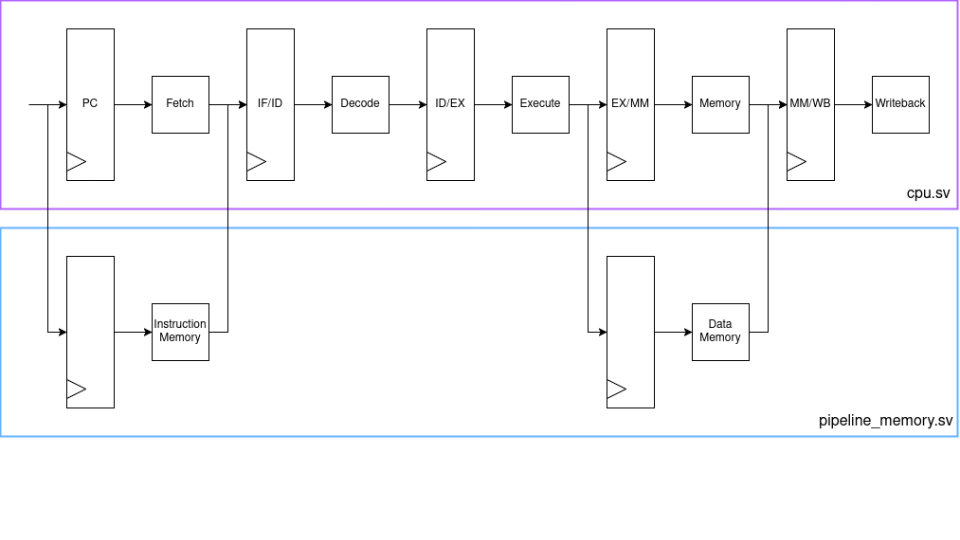

# Pipelined RV32I Processor
This is a Public Repository to go over my implementation of a pipelined processor that runs the rv32i ISA. This project was done for ECE 411 at UIUC. Full implementation kept private to respect academic integrity and course policies. Detailed walkthrough, architecture discussion, and code review available by request or during an interview. Feel free to message me on Linkedin (https://www.linkedin.com/in/luke-smith-500730377/) 

## Overview

This processor implements the complete RV32I base integer ISA (excluding `FENCE*`, `ECALL`, `EBREAK`, and `CSRR*`) with a classic 5-stage in-order pipeline. The design achieves near-1 IPC on instruction sequences without data dependencies, with full hazard resolution.

**Synthesis targets met:**
- Area: ≤ 20,000 μm²
- Clock frequency: 500 MHz (2 ns period)
- CoreMark IPC: ≥ 0.6

## Pipeline Architecture

The pipeline is partitioned into five discrete stages, each implemented as its own SystemVerilog module. Stages communicate via packed structs passed through registered pipeline stage buffers (`IF/ID`, `ID/EX`, `EX/MM`, `MM/WB`).

### Fetch (IF)

- Maintains a program counter that resets to `0xaaaaa000`
- Issues word-aligned read requests to instruction memory using a 4-bit read mask
- Implements **static not-taken branch prediction**
- Suppresses the IF/ID register update and marks the fetched instruction invalid on a control flush

### Decode (ID)

- Decodes all RV32I instruction formats
- Sign-extends all immediate variants (`i_imm`, `s_imm`, `b_imm`, `u_imm`, `j_imm`)
- Reads source register values from the register file
- Propagates a `valid` bit; clears it on a control-taken flush to prevent stale instructions from modifying architectural state

### Execute (EX)

- Contains an 8-operation ALU (ADD, SUB, SLL, SRL, SRA, XOR, OR, AND)
- Contains a comparator for branch resolution (BEQ, BNE, BLT, BGE, BLTU, BGEU)
- Computes data memory address and byte-enable masks for loads and stores
- Resolves control flow: drives `control_taken` and `target_pc` back to the fetch stage on taken branches, JAL, and JALR
- Houses the **data forwarding logic** (see Hazard Handling below)

### Memory (MM)

- Issues naturally-aligned load and store requests to data memory using separate read/write byte masks
- Drives `dmem_stall` when a memory request has not yet received a response
- Caches the data memory response for one cycle (`dmem_rdata_cache` + `dmem_resp_arrived` flag) to handle the pipelined memory model correctly—the memory model's internal register is absorbed into the EX/MM pipeline stage boundary, keeping the effective pipeline depth at 5 stages rather than 6 or 7
- Performs byte/half-word sign and zero extension for `LB`, `LBU`, `LH`, `LHU`, `LW` using the stored read mask

### Writeback (WB)

- Selects the final register-file write value from the MM/WB pipeline register
- Drives the register file write enable, write address, and write data
- Gated by the `valid` bit so flushed/bubbled instructions never commit

## Hazard Handling

### Data Hazards — Forwarding

The execute stage implements two forwarding paths to eliminate RAW stalls on most instructions:

| Path | Source | Destination |
|------|--------|-------------|
| MEM → EX | `rd_v` from the MM stage | `rs1_v` / `rs2_v` in EX |
| WB → EX  | `rd_v` from the WB stage | `rs1_v` / `rs2_v` in EX |

Forwarding is suppressed when the source instruction does not write the register file or when the destination is `x0`.

### Load-Use Hazard — Stall + Bubble

A load instruction's result is not available until after the memory stage. When the instruction immediately following a load reads the load's destination register, a one-cycle stall is inserted:

- The IF/ID register is held (fetch stage freezes)
- A bubble (`'0`) is injected into the ID/EX register
- Downstream stages (EX/MM, MM/WB) advance normally

### Control Hazards — Flush

Branch outcomes and jump targets are resolved in the execute stage. On a misprediction (branch taken) or any unconditional jump, the two instructions already in the IF and ID stages are squashed by clearing their `valid` bits. The PC is redirected to the branch target pc.

### Structural Hazards — Global Stall

A `global_stall` signal is asserted whenever the instruction memory or data memory is not ready.

## Memory Interface

The processor exposes two independent 32-bit memory ports:

| Port | Signals |
|------|---------|
| Instruction | `imem_addr`, `imem_rmask`, `imem_rdata`, `imem_resp` |
| Data        | `dmem_addr`, `dmem_rmask`, `dmem_wmask`, `dmem_rdata`, `dmem_wdata`, `dmem_resp` |

Both ports use byte-enable masks.

## Register File

32 × 32-bit general-purpose registers with one write port and two read ports. `x0` is hardwired to zero as per the RV32I specification.

## Type System

All pipeline stage data is carried in packed structs defined in `types.sv`. Each stage register carries:
- Instruction word and PC values for RVFI monitoring
- Decoded immediate variants
- Source/destination register addresses and values
- Control signals
- Memory access fields 

## Verification

Functional correctness was verified using the **RISC-V Formal Interface (RVFI)** connected to the Spike ISA simulator. Each committed instruction in the writeback stage emits a bundle of signals (PC, instruction word, register reads/writes, memory address and data) that Spike validates cycle-by-cycle against its golden reference model.

## Tools & Technologies

- **Language:** SystemVerilog
- **Simulator:** Synopsys VCS with Verdi
- **Synthesis:** Synopsys Design Compiler
- **Linter:** Spyglass
- **Build system:** SCons
- **ISA reference:** RISC-V Unprivileged ISA (RV32I)
- **Formal verification interface:** RVFI / Spike
